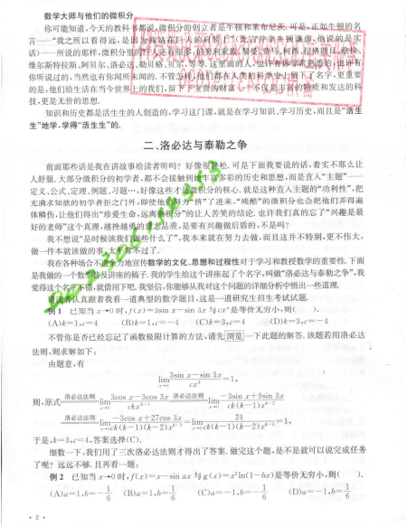
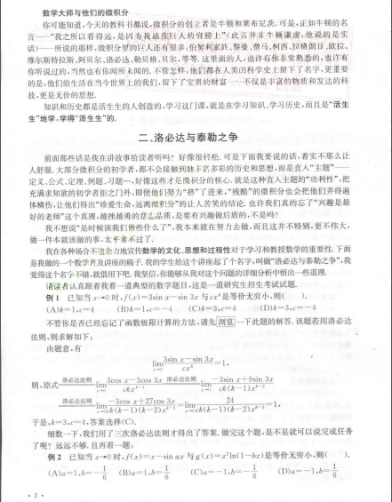

# Remove PDF Watermark

A simple python script to remove embedded watermarks and color stains for scanned PDF.

简单去除扫描版 PDF 中的水印

---

## Experimental Result

 

## Requirements

- Python 3
- Pillow
- PyPDF2
- img2pdf

## Usage

```shell
usage: pdf-watermark-removal.py [-h] [-o out] [-s SKIP] PATH

positional arguments:
  PATH

optional arguments:
  -h, --help            show this help message and exit
  -o out, --output out  Output PDF file
  -s SKIP, --skip SKIP  Skip over the first n page(s).
```

example:

```shell
$ pdf-watermark-removal.py --skip=1 --output=output.pdf document.pdf
```

## License

The software is released under the MIT license.
